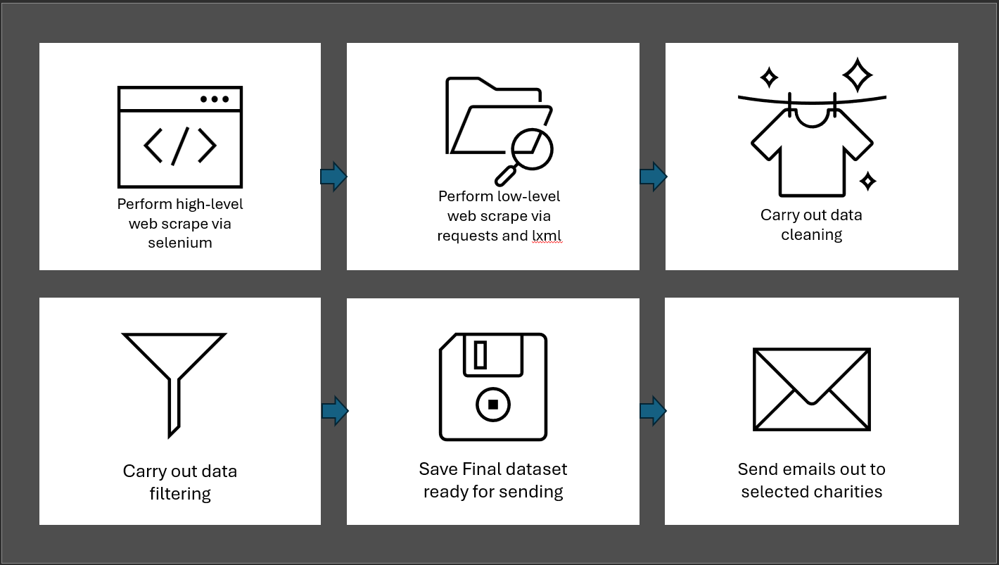
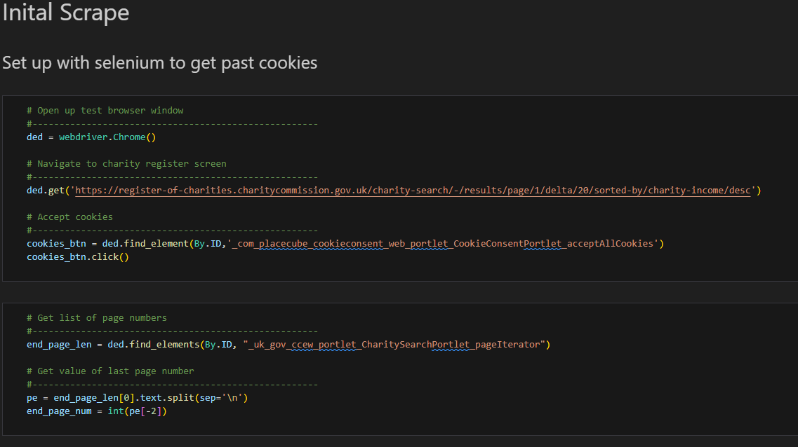
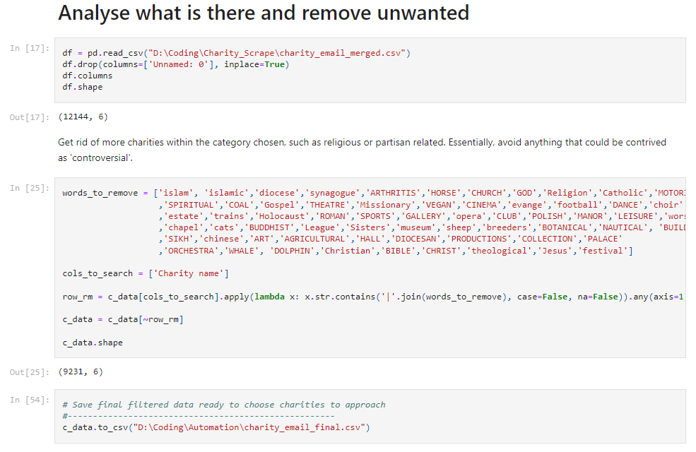
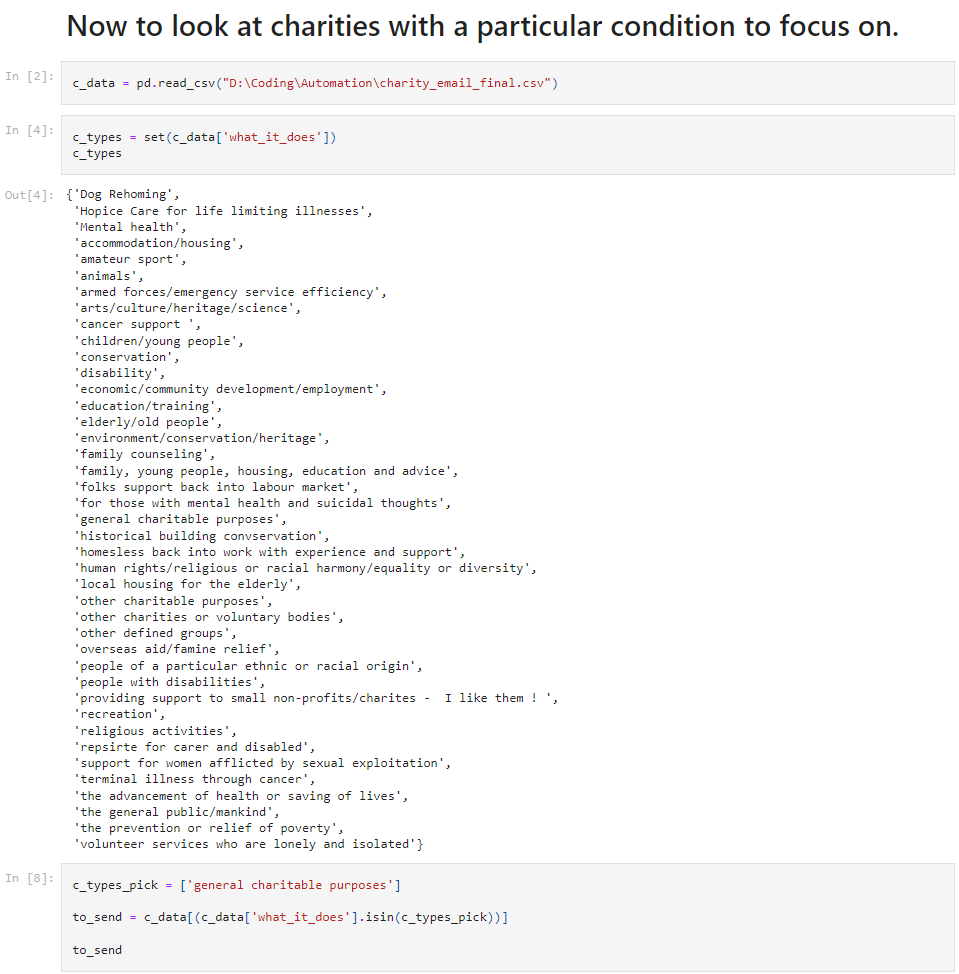
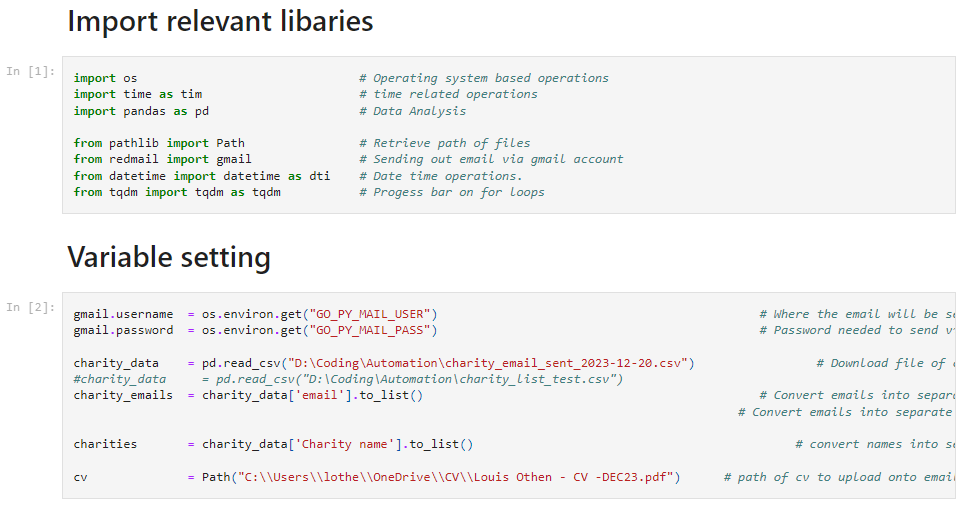

# The Charity Scrape Project 

## Introduction 
### TL:DR
Goal of project was to perform a web scrape of all organisations found on the gov.uk charity register ([GOV.uk Charity Register](https://www.gov.uk/find-charity-information)). Then to filter to charities I wish to contact. Finally, send an automated email out to them based on the selected charities. 

Please see simple diagram below of the high-level process:

### Long Story Version
As part of my wish (at the time) to work for good causes, I was initially looking to utilise my skills in Data Analytics, Science, Engineering and Machine Learning for them. However, I wanted to use these skills on a consultancy basis for charities and non-profits that I believed were doing the right thing; in other words to "help people, who help people".  

As part of this goal I wanted to understand how i could acquire the relevant details of these organisations for me to approach and see if they needed any assistance with their data needs.

The reason for wanting to get into this potential business venture, was due my previous experience dealing with some consultancies, where have targeted charity organisations that get little support in this area, and charge unfairly for their services. Not only this, but also tend to attempt to inaugurate themselves into the organisations structure, which in my head poses two problems:

1. Charging high fees (up to £2,000 per day for a senior consultant - based on my exposure), that takes much money away from the charity's intended cause.
2. Provide the most basic service for such high fees, providing little training or support in any new practice they provision.
3. With such provisions, place them in a position, where the charity cannot function in the same way without them going forward, becoming dependant on the consultancy.

These things above I wanted to change entirely:
- Charge fairly, enough to ensure my needs are met (bills have to paid still!) but at a fraction of the price above, saving at least 60% or more in comparison.
- Tailor to what they need, based on real situations that affect them day to day, to save money , time and stress in the long run.
- Help those we work with learn and improve the ways of working with the use of data.
- Up-skill and learn from one another on what is best both short and long term.
- Allow the Charity to be self sustaining once the work is done, so there is no need to depend on someone like me in future! More, they have the option to collaborate in future (if I did a good job!).

Anyway, one of the first steps I could take, was to understand how many charities are out there in the UK. Additionally, understand which charities I could approach with this idea, before going any further.

Therefore - and the reason for this project - my initial goal was to produce a simple web-scrape of all the charities in the UK, that were registered on the gov.uk charity register:

[GOV.uk Charity Register](https://www.gov.uk/find-charity-information)

Once scraped and filtered, to then send an email to the contact details provided on the register, with my details and explain my idea.

## Tools / Pre-requisites
In order to replicate the work conducted here, the following items/ libraries/ tools etc were used:
### IDE 
[Visual studio Code](https://code.visualstudio.com/) with the following extensions:
- python
- pylance
- jupyter

### Python
Including Python 3, the following libraries were used throughout the whole process:
| Library Name | What it does |
| ------------ | ------------ |
| Selenium | Automation of web browser steps |
| BeautifulSoup | To Parse Through Web/HTML elements |
| tqdm | To Show loop iteration progress |
| requests | To perform HTTP calls over the internet |
| lxml | Advanced parsing of HTML/XML |
| re | Regex operations |
| plotly | To display interactive Data visualisations |
| datetime | Datetime operations |
| pandas | Data analysis and manipulation |
| os | Operation System operations |
| pathlib | retrieve path of files |
| redmail | send out emails via gmail account |

## Steps Taken 
Steps involved so far are relatively straightforward, but some steps can take a little while. So, I attempted to section the code in the notebook 'charity_registerscrape.ipynb' to accommodate for this.

To proceed further, the following notebooks are done and ran (in order) from data scrape to sending an email out to selected Charities:

### Charity Register Web Scrape
[Link to notebook](https://github.com/lou-i0/Charity-Scrape/blob/main/charity_registerscrape.ipynb)

#### Initial Scrape
The first step is to access the charity register using selenium, in order to bypass the cookies acceptance before continuing to get the total pages to collect high level data from.

From there, we then switch to requests and lxml to first parse through the header level data, before then going into each individual page to retrieve the lower level information for each charity parsed. 

#### Data Cleaning
Now that the high level charity information as well each of its individual details are collected within the separate links below, we now need to clean up the data we have scraped, which includes:
- Removing any rows with missing values (for now at least)
- Removing columns such as index, charity number etc (columns that - for now - are not needed)
- Tidy up the overview column removing unneeded whitespace.
- Created or cleaned columns from the data which covers, website, email address, phone number, address
- Convert all data to lowercase for ease of later work.

Now all of the above is complete, save a copy of this dataset down ready for further use. 

#### Data Filtering 
For this phase, the goal was to understand which organisation in which to approach. The first round of filtering involves the organisationI felt should not be approached. The reason for this was not from a place or malice or hate, but more to avoid any organisations that could be considered Controversial; such as anything that has a stance or partisan on religion or politics, or need to do something for them in order to get help.

While this can inherently comes with personal bias, I just wanted to focus on charities just with an aim of doing the right thing, simple as that. with this filtering I had to initially manually filter out charities that contained certain words, similar to the screenshot below:

The second round of filtering involves the column 'what it does'. The charities are all assigned a category in the 'what it does column' like so:

For the first instance, I chosen to record show charities with the 'general charitable purposes' only, with scope to change this and expand on it in future. 

with all the above now complete, the next and final stage is to use this cleaned and filtered dataset we scraped to send an automated email out to some of these charities (more explained on that later).

### Email Charities from final dataset
The final set of steps in this exercise is to use the cleaned and filtered dataset scraped from the charity register, to approach via email to pitch them the services we can provide. 

for all the steps in this section, is covered in the following notebook:

[Link to notebook](https://github.com/lou-i0/Charity-Scrape/blob/main/email_automation_script.ipynb)

#### pre-requisites for this notebook
Before this notebook can be ran successfully, there is a need to obtain an app password to your personal gmail account, to then be used in the python script and send from there. to do this do the following steps:

- Go to your google account 
- Go to security
- Search for app password
- Create a name for your app password and follow the steps.
- You should then save the password down to be used shortly. 

Secondly , once you have the relevant information you should add to new environment variables onto your local machine for you gmail username and  app password, which can then be past later via the os library in your python code. 

the initial variables as seen in the screenshot, required the use of os and environment variables on you local machine to ensure both use and privacy of not showing sensitive information.'

Finally, we use the redmail library to set up a email to send out to the organisations within the dataset, with the remaining code fairly self-explanatory.

And there we have it!

## Reflection 
Some notes to place here based on my experience and what i may change in future:

- Realised that the gmail email sending only functions sucessfully up to  emails before its stops, so had to select up to  charities to approach from the saved dataset, and added code in the initial python script to remove charities that i have already sent emails previously to.

- Did get some some good responses back at the time, but i feel the email structure needs changing as most were only interested in the free work i would offer, rather than a continuing relationship after this point. 

- More of a personal note, learnt alot about what i feel i need to focus on working with going forward, to work for folks doing the right or something important, or ideally both!

- I hope anything of this work proves useful to someone else, but do get in contact if you have any comments, improvement etc.

- Thanks for reading! :)

